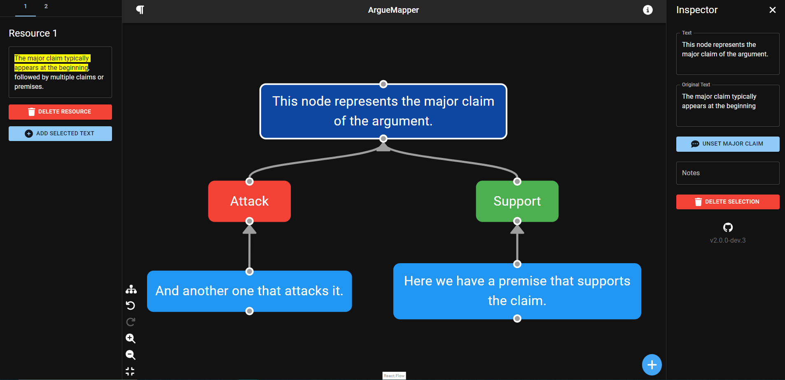
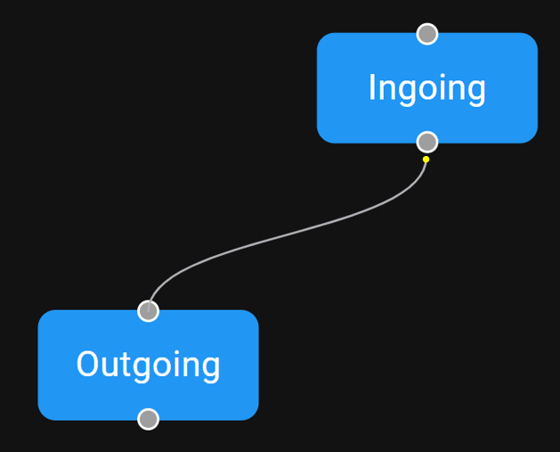
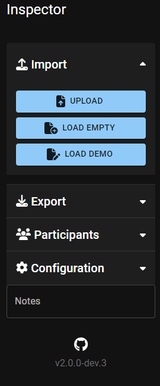
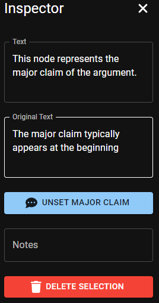
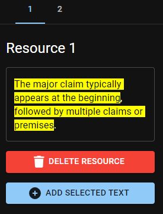
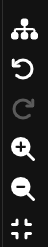

# ArgueMapper

The ArgueMapper tool can be used to convert arguments in plain texts (e.g., newspaper articles) to structured argument graphs.
Existing tools to create argument graphs are tailored for experts in the domain of argumentation.
ArgueMapper is the first of its kind to be optimized for mobile devices and provide a discoverable interface suitable for novice users.
You can try it out immediately by visiting our [hosted version](https://arguemapper.uni-trier.de).
There are no server-side components in this app, so your data never leaves your device.



## Docker Image

```shell
docker run -p 8080:8080 ghcr.io/recap-utr/arguemapper
```

## Tutorial

Short guide for sample use cases, more details to any feature further below.
Last state the website was in will be auto saved if you reload or close the website.

### Wording

- Atom-Node: A Node that contains Arguments
- Scheme-Node: A Node that describes connections between Arguments (Support, Attack, Unknown, Rephrase, Preference). Also specifies “Argumentation scheme” (eg. Bias, ad hominem, expert opinion,…)

### Create a new Graph

1. Click on the +-Button at the bottom right of the working area and choose if you want to add an Atom or a Scheme Node
2. The Node will be selected and can be dragged around inside the working area with the mouse
3. On rhe right in the inspector
   a) If you select an Atom Node you can assign a Text to it and/or mark it as the major claim
   b) If you select a Scheme Node you can assign a Scheme Type or Argumentation Scheme
4. You can move around Nodes per drag+drop or use the Auto Layout in the lower left Toolbar
5. You can zoom in and out using scrolling or the Zoom-Tool in the lower left Toolbar
6. If you want to connect Nodes click on the Top connection circle of the outgoing Node and drag your mouse to the Bottom connection circle of the ingoing Node
7. A new Scheme Node will be automatically added in the new connection



### Import and change an existing Graph

1. On the right side of in the Inspector you click on Import, there you can click on Upload to upload a .json File containing the data for the graph (eg in arguebuf-format)
2. If successful, you should see your graph in the working area now, Participants (if provided) can be found on the right in the Inspector
3. If you want to change the content of Node you click on a Node to select it, on the right in the Inspector you will be able to change the Text (Atom Node) or eg the Scheme Type(Scheme Node)
4. If you want to add new Nodes follow the previously explained steps from **a)**

### Inspector


Open or collapse the inspector pane.



- By clicking on one of the Menu Cards (Import, Export, Participants, Configuration) you can open up further options, clicking again or opening another menu will collapse the current one.
- Depending on the selected element the contents of this pane will change dynamically. The screenshot shows the view when no element is selected.

- Import:
  - Upload: Upload a file in JSON Format
  - Load Empty: Loads an empty state, the current state gets overridden by this
  - Load Demo: Loads a small demo argument graph containing two sample arguments and their connection to a sample main argument
- Export:
  - Exports current graph and other informations (eg Participants) into a downloadable file in the formats Arguebuf(.json), .aif, .png and .jpg.
- Participants:
  - Allows to add one or multiple participants to the current file or if a file was uploaded shows all that were documented in that file
  - Open and Collapse each Participant via Click
- Configuration:
  - Edit Analyst: Allows to change the Name/E-Mail of the current analyst
  - Layout Menu: Allows to choose the style in which the graph will be shown
  - Edge Type Menu: Allows to change the style in which the edges(connections between Nodes) will be shown
  - Image Scaling Factor: Changes the output image if a .jpg or .png is exported (pixel density will change)
  - Prettify JSON: An exported JSON File will have line-breaks if activated, otherwise it will be in one line
- Notes:
  - Note something for or about the current graph

### Edit Nodes



- by clicking on a node you get further options in the Inspector field
- by right-clicking a menu opens to Delete a Node (and Set as major claim for Atom Nodes)
- For a single selected Atom Node you can:
  - Edit the displayed Text inside the Node
  - Add an “Original Text” to save it during changes
  - “Set as major claim” sets the current selected node as the major claim of the graph, there can only be one major claim, it will be highlighted in a darker blue color
  - Add a general Note for this Node
  - Delete this Node
- For a single selected Scheme Node you can:
  - Change the Scheme Type
  - Change the Argument Scheme
  - Add a general Note for this Node
  - Delete this Node

### Resources


Open or collapse the resource pane.



- You can create multiple text resources and switch between multiple tabs of such resources
- Mark some text in the textfield and with “Add Resource” a node will be created that contains this text
- “Delete Resource” deletes the current Tab and its Text Resource

### Toolbar



- Auto-layout: Automatically creates a sensible Layout for the current graph
- Forward/Backward: go forward and backward in the history of the current graph, all changes to any element will be logged, Configuration settings will not be logged
- Zoom in/out: Allows to zoom in or out on the graph. Also possible with mouse scrolling
- Auto-Zoom: Automatically zooms and centers the graph to the current working field size
