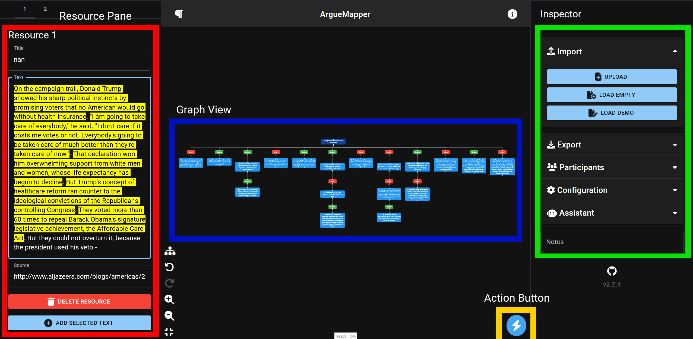

# Guidelines for Using the AI Assistant in Arguemapper

## The Interface



## How to Access

In the Inspector on the right, there is a tab labeled "Assistant" that can be opened by clicking.

This tab contains three fields: **API Key**, **Model**, and **Base URL**.

- **API Key:**

  - Paste a key (if necessary) into this field, e.g., your OpenAI API Key.
  - Billing (if necessary) will be tied to this key.

- **Model:**

  - Choose a model that will perform the actions.
  - Currently available by default: GPT-4o and GPT-4o-mini.
  - For a list of all OpenAI models, please visit their [models overview](https://platform.openai.com/docs/models/gpt-4o-mini). Keep in mind that only models capable of [structured outputs](https://platform.openai.com/docs/guides/structured-outputs) can be used. More models will become available over time, including the option to connect to privately hosted models (e.g., LLama by Meta).

- **Base URL:**
  - The Base URL of the AI model provider. By default, it points to OpenAI's services.

## Usage

You can click the Blue Action Button in the main UI, where you would also add new Scheme and Argument Nodes. Several options are available: **Generate Complete Graph**, **Extract ADUs**, **Identify Major Claim**, and **Predict Relations**.

- **Generate Complete Graph:**

  - Extracts the Major Claim, ADUs, and predicts their relations in a single step.
  - The AI uses the Text Resource on the left; if it is empty, no extraction will occur.
  - It only uses the currently visible text resource and ignores any others if multiple exist.
  - As the AI takes over the entire process, errors can be propagated from one task to the next. Because of this, argument graphs produced using this option tend to vary from one run to another and might deviate noticeably from a graph produced by a human annotator.

- **Extract ADUs:**

  - Only extracts the Argument Nodes.
  - Existing Nodes in the UI will be deleted during this process.
  - Custom Instructions that request the model to keep certain nodes (e.g., a Major Claim) may result in errors.

- **Identify Major Claim:**

  - Identifies the Major Claim.
  - Searches only within existing Argument Nodes. If no nodes exist, an error will result.

- **Predict Relations:**
  - Predicts relations (Scheme Nodes) between existing Argument Nodes.
  - Occasionally, not all Argument Nodes will be connected in a single Graph, so manual checking is required after the action.

When selecting one of these options, a dialog will open, allowing you to include a **Custom Instruction Prompt**. The model will follow this instruction, significantly impacting the results.

## Example Workflows

1. First, load or paste a Text Resource, identify the Major Claim and ADUs manually, and then use the assistant's "Predict Relations" feature to save time connecting them manually. Afterward, review the relations for accuracy.
2. Load/paste a Text Resource, generate the complete graph using the assistant, and then check for errors.
3. Load/paste a Text Resource, identify the Major Claim manually, extract the ADUs with the Major Claim in the Custom Instruction Prompt. Relations can be added either manually or using the assistant.

Which workflow works best depends somewhat on the structure of your data. When working with well-structured texts, e.g., an argumentative text from a dataset, the assistant should be able to also generate the entire graph on it's own, especially if given certain hints of the structure in the Custom Instruction Prompt. If a full graph generation is completely off at times, a retry can often help.

## Our Experiences with the Workflows

The following notes describe our experiences using GPT-4o and GPT-4o-mini.

Generally the **most useful workflow** we found thus far, excluding more complex prompt engineering, is **workflow 1**. This saves a lot of time in connecting the nodes manually and is usually met with only low error rates.
Generating the **full graph** has the **highest error rate**, since the model needs to do anything in this scenario, so if it missteps once, significant parts of the graph can be wrong as a result.

Surprisingly, the models also sometimes **struggle to find the best Major Claim**, so 3) can be a useful workflow here. It also appears that knowing the Major Claim from a Custom Instruction Prompt helps a model to find the Arguments. This can be done simply by adding "The Major Claim is: &lt;_claim_&gt;" into the Custom Instruction Dialog.

Finally, if a text is fairly convoluted and even difficult for a human to process correctly, or if it's fairly vague, it is very likely that the models will also struggle more, leading to a higher error rate. This is however not predictable. Rarely the models also try to hallucinate some text or add something to an extracted Argument, so you might need to watch out for that, especially with weaker models (eg GPT3.5, or similar ones)

Another workflow (which does not use the build-in assistant) is to **use currently unavailable models** as helpers (eg o1-preview by OpenAI). You could for example take a text resource you have and ask it to **filter out the Arguments** (or even the entire Graph Structure), and even to **write a Custom Instruction Prompt** for you, that you can then paste into the Assistants Dialog to generate the Graph. Since this needs some extra steps, and especially because of the slower inference time of eg the o1 series, this might not speed up the process.
It can be useful to try to solve some pieces of the dataset by hand and look how long it took for you, with this you can compare different approaches, on how much they speed up the graph creation in your specific use case.

## Disclaimer and Tips

The AI models available can **significantly speed up** the creation of Argument Graphs but are **prone to errors and are not deterministic**. The same input and Custom Instruction Prompt will almost never yield identical results. If something goes wrong, **try multiple attempts** — at least twice. The results however are probabilistic, a **well-crafted Custom Instruction** that has previously worked well will generally continue to yield better results, even if it occasionally fails.

If you are using or experimenting with a Custom Intruction it is helpful to edit it within a text editor and copy-pasting it into the dialog, in case of an error the Instruction gets lost, so this saves time in rewriting it.

**Prompt engineering** has a **significant impact** on the final results, but it is **not necessary** for getting acceptable outcomes. The default settings are usually sufficient. More information and examples on Prompts will follow later in this documentation.

**Model performance varies widely**. For example, GPT-3.5-Turbo often performs significantly worse than GPT-4, but can still be useful in some scenarios. Always consider the **trade-off between cost and performance**. For instance, generating a Complete Graph with GPT-4 costs roughly $0.015 - $0.03 (as of September 2024).

## New models

The new reasoning models by OpenAI, currently not available in the Assistant (as of September 2024), o1-preview and o1-mini seem to be very capbable of extracting even entire graphs, especially o1-preview, with o1-mini struggling with a decent graph structure.

## Custom Instruction Prompt Engineering Tips

While the assistant works well without Custom Instructions, creating **specific instructions** can sometimes be **beneficial**. This is especially true when dealing with a **dataset** containing **similarly structured** texts. You can use a Prompt to guide the model around the general structure of the text, improving performance significantly. Providing **solved examples** can also be helpful, so the model doesn’t have to solve the problem from scratch (zero-shot). It may take a few tries to find which prompt works best, as even **slight changes** to the Prompt can lead to **dramatically different outcomes**. For instance, even missing or different punctuation can have a significant impact.

**Predicting Relations** often works **best without a prompt**, compared to other assistance tasks, but improvements can still be made here too.

Since LLMs (like GPT-4o) behave unpredictably compared to typical software, it’s often better to think of them differently when writing prompts. A useful approach can be to imagine the assistant as an overworked but knowledgeable intern. Sometimes, telling a model to behave a certain way doesn’t work unless you **repeat the instruction multiple times in different ways**. If the author of the prompt **wouldn’t know how to respond** to it, then the prompt likely **won’t result in good performance**.

Prompts can also **introduce errors**. Sometimes the model does not follow the structure given in a prompt, especially when told to adhere to a specific format in its responses.

## Examples for Custom Instruction Prompts

```txt
Firstly look for the correct major claim, this can be usually found at the end of the given essay, eg "in conclusion i think xyz is good" then the major claim would be "xyz is good" and the arguments are there to exacerbate this.
Rather retrive less arguments than too many, i can still add any missing one manually afterwards. Think step by step.
```

This prompt was used for a dataset where the major claim of the argument is very often found at the **same position** in the text and in a fairly **similar style**, if the position varies over multiple texts it is useful to change the prompt accordingly (e.g., found at the start instead of found at the end).

As explained earlier, at times it’s useful to give out an **example** of a piece of data and it's **solved Graph**. Since visual inputs are not possible as of now, you need to encode the solution into text. You could for example mark Argument Nodes with a # in front, and explain their relations between each other in ( ), as long as a human could read and understand the encoding you’ve chosen the models likely will too.
The following example combines this approach with the previous example (since it is an original data piece it contains spelling errors):

```txt
Firstly look for the correct major claim, this can be usually found at the end of the given essay, eg "in conclusion i think xyz is good" then the major claim would be "xyz is good" and the arguments are there to exacerbate this.
Rather retrive less arguments than too many, i can still add any missing one manually afterwards. Think step by step.
Ill give you an example of how i would do it, first youll get the original text, and then my extractions, first the major claim, followed by connection information eg -(support to main claim) means the connection goes to the main claim as a support, # signifies an individual argument:

Original text:
Many people believe that children should study at school to have more knowledge that prepare better for their future. Others, however, think that these children may disrupt their school work and should be allowed to leave school early to find a job. Personally, I tend to agree with the point of view that student have to be forced to study at school.
First of all, schools offer to students a good environment with experienced professors and high quality programs for studying. It creates the best conditions for students education and can force them to focus on their school work instead of wasting their time to do useless things. Second of all, schools provide lots of academic knowledge to students. Students may learn professional skills, expand their understandings and gain experiences. Therefore, they have more opprotunities to find a job and to be successful in the future. For example, as we know, employer always prefer to hire an employee of high degree who have professional skills.
Nevertheless, it is not unreasonable that some people think that children should interrupt their school work and get a job. Whether children can learn a lot at school, there are many subjects that will be of little value to them in the future. Furthermore, children can learn social skills when they have a job. They can get more experiences that can not be obtained at school. Working helps children be more independent and teach them to esteem and manage the money that they've earned.
Overall, I believe that students should study at school. Even though there are some advantages of leaving school to find a job, studying at school is always the best choice for children's future. There are many ways that can train children to learn independent and social skills instead of getting a job.
#####
My extractions:
(custom main claim formed out of the opinion of the essay)
Main claim: Students should study at school and not take a job early by dropping out
arguments:
-(attack on main claim)
#Whether children can learn a lot at school, there are many subjects that will be of little value to them in the future
-(support for previous argument)
#Working helps children be more independent and teach them to esteem and manage the money that they've earned
#They can get more experiences that can not be obtained at school
#children can learn social skills when they have a job
-(support on main claim)
#schools provide lots of academic knowledge to students
-(support for previous argument)
#they have more opprotunities to find a job and to be successful in the future
-(support for main claim)
#schools offer to students a good environment with experienced professors and high quality programs for studying
```

Another way to improve the quality of the graphs produced by the assistant is by specifying in detail what form ADUs and the major claim should have. One of our testers successfully used the following custom instructions to do this:

```txt
Extract argument discourse units (adus). These are explicitly not facts, but statements, which can be proven right or wrong by argumentation. Also, only the actual statements should be extracted (e.g., "the region is important"), not the context (e.g., "person A says that the region is important").
```

```txt
Identify, which of the extracted argument discourse units (adus) is the major claim, i.e., the quintessence of the entire argumentation. It should have the character of a summarization of the other points or a conclusion.
```

Note that the shown approaches are not proven to be optimal, but resulted in often successful annotations nevertheless when generating a complete graph.
Also note that with specifically fine-tuned models prompts and results will vary massively, the same will likely be true for upcoming reasoning models like OpenAIs o1 series, prompt behaviour and model performance also **changes unpredictably** within the same model if said **model gets updated**, therefore you need to specify when a prompt worked exactly, to have a fallback strategy in case of an update.

If you have trouble coming up with a prompt, the models themselves, wherever they are accessible, can also help you craft some as a starting point.

## Customizable Model Parameters

---

**Notes**:

- The **effects of these on generation quality** are yet to be explored or need to be explored by the user depending on their use case.
- LLM (or similar AI models) are not outputting words, but instead something called **tokens** one after another. The models have a large set of tokens (which can be anything from numbers to letters, or parts of words, ...) for which they will **calculate the odds** of being the next one. For example: This sentence is already put out "This tree is gr...", now the model estimates what comes next with what chance, "een" will get a much higher liklihood than "ey", since "This tree is green" is a much more likely solution than "This tree is grey". The odds of any new token is based on all the **tokens** that came **beforehand** however(\*), so for example if the full text in this example is: "Everything is grey. The sky is grey. The ground is grey. The tree is gr..." then "ey" will be more likely than "een" as the next token. A simple overview over the functioning principles of LLMs can be found [here](https://arstechnica.com/science/2023/07/a-jargon-free-explanation-of-how-ai-large-language-models-work/).
  **(\*)** within the context window of the model, there is a **limited number of tokens (context window)** the model can use as input and anything before these will be ignored. The exact number depends on the [model](https://platform.openai.com/docs/models/gpt-4o), but is generally greater than 32000 Tokens, with some models able to use millions.

---

### Frequency Penalty

This parameter can be set between **-2.0 and 2.0,** per default it is 0.
This parameter penalizes reoccurence of already generated output, for example if a text contains a certain word already it gets penalized if it uses it too often afterward, therefore reducing the likelihood that it comes up again. This parameter uses the existing frequency in the output, so eg if it generates a line, the higher this value is set the lower the chance for it to occur again will be.

### logit bias

This parameter can be set between **-100 and 100**, default is 0.
This parameter is a map, eg: "word1": 100, "word2": -1, ...
The given number either increases or decreases the likelihood that this word will be generated in the output, for example "word2" being mapped to -1 means that this word (or rather token) has a slightly lower chance to be generated, while "word1" mapped to 100 means that this word should be used exclusively (analog a -100 means its banned from generation).

### logprobs

This parameter can be set either **True or False,** default is False.
If set True the output by the model will not only contain the usual information, but also the logarithmic likelihood of any single token in the output.
This will (very likely) not effect the generation in a usable way, but might be interesting for analyzing models "reasoning" in the background.

### top_logprobs

This parameter can be set between **0 and 20**, default is 0. Note that **logprobs needs to be set to True** for this to work.
At any token in the output it will output a list of 0-20 tokens ordered by their logarithmic likelihood, it will also output this value for any of the 0-20 ones. The displayed tokens are the 0-20 ones with the highest chance of being the next one.
This will (very likely), just as the previous parameter, not be useful for generating graphs, but rather for deeper analysis of the outputs.

### max_completion_tokens

This parameter is a natural number, it will be between **0 and the maximum number of output tokens** of the given model. The absolute maximum depends on the model, its version and more, so you need to look this up for your chosen model. An example value is chatGPT4o (as of July 2024) with a maximum number of 4096 output (or completion) tokens. The model can not put out more than this and therefore if the text you want to create a graph for is extremely long it might not be able to put out all the arguments or cause an error. With this you can limit the model though in it's output to eg save costs, but beware that the model will not know where it's limit is (unless you explain this in the custom instruction prompt, which it may not follow accurately!) and it's output will just end once this limit is reached, which might cause errors.
But note that the model doesn't always use the full amount of allowed tokens, so even if you set this limit to eg 3000, it might just output 300 if that's all it needs for it's generation.

### n

This parameter is a **natural number**. Per default it is set to 1.
This will cause the model to create n different generations, it will likely not be useful for creating a graph, but potentially for analysis in the background.

### presence penalty

Comparable to Frequency penalty, but counts for presences of individual tokens, instead of frequency.
The higher the value (also -2.0 to 2.0) the higher the chance the model will go towards a different topic.

### seed

**Note**: This parameter is in Beta for OpenAI models.
This parameter can be set between 0 and a multi-digit number, per default it's random.
This parameter increases the chances drastically that the output becomes more deterministic. This can be especially useful to test custom instruction prompts, similar seeds usually lead to a similar result, but this is not guaranteed!

### temperature

This parameter can be set between **0.0 and 2.0**. Default is 1.0.
This parameter increases the "randomness" of the model the higher it is, generally a value above 0.8 means the models behaviour is quite random, while a value below 0.2 is more deterministic.
This is likely useful for testing custom instruction prompts. Some outside research suggests that certain values reduce the "intelligence" of the model, a value of 0.0 for example will very often lead to a similar output, but if it's a wrong one, then it will always be wrong even in following generations. On the other hand, low values also reduce hallucinations where the model makes things up. It is advised to test this for your usecase.
Note: You should not change this and top_p at the same time.

### top_p

This parameter can be set between **0.0 and 1.0**. Default is 1.0.
This parameter forces the model to only consider those tokens that are within a given percentile of all the possible next tokens based on their likelihood.
For example a value of 0.1 will mean that only the Top 10% most likely next tokens will be considered for the next token. Assume for example this list of possible next tokens "grey":10% chance,"red": 25% chance..., "two":95% chance, "three": 99% chance, then eg "grey" and "red" would not be used by the model for the next token, no matter what.
**Note**: You should not change this and temperature at the same time.
